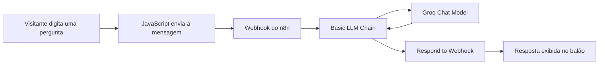

# DevClub — Página Institucional

Página institucional responsiva e interativa desenvolvida para representar o ecossistema DevClub, suas formações, metodologia, professores, projetos, benefícios e oportunidades de carreira em tecnologia.

O projeto combina uma identidade visual tecnológica com animações, microinterações e um assistente virtual integrado ao n8n e à Groq.

## Demonstração

**Acesse a página publicada:**

[joaojnr10.github.io/site-institucional-devclub](https://joaojnr10.github.io/site-institucional-devclub/)

**Repositório:**

[github.com/joaojnr10/site-institucional-devclub](https://github.com/joaojnr10/site-institucional-devclub)

## Sobre o projeto

O objetivo foi construir uma página institucional que não apenas apresentasse informações, mas proporcionasse uma experiência visual marcante.

A interface foi desenvolvida com HTML, CSS e JavaScript puros, sem frameworks, valorizando domínio dos fundamentos do desenvolvimento front-end.

Além do conteúdo institucional, o projeto conta com o **Clubinho**, um assistente virtual capaz de responder dúvidas relacionadas ao DevClub. A comunicação acontece por meio de um Webhook do n8n, que processa a pergunta e utiliza um modelo de linguagem da Groq para produzir a resposta.

## Principais funcionalidades

- Layout totalmente responsivo para computadores, tablets e celulares.
- Identidade visual inspirada em tecnologia e programação.
- Céu animado com estrelas e meteoros gerados dinamicamente.
- Painel de código tridimensional na seção principal.
- Animações de entrada durante a rolagem.
- Faixas laterais infinitas de empresas, tecnologias e habilidades.
- Cards interativos para formações, projetos e depoimentos.
- Lista horizontal de professores com scroll controlado.
- Seções de certificado, mercado, garantia e perguntas frequentes.
- Microinterações em botões, links, cards e elementos visuais.
- Respeito à preferência de redução de movimento do usuário.
- Assistente virtual integrado ao n8n e à Groq.
- Tratamento de carregamento, indisponibilidade e erros do assistente.

## Tecnologias utilizadas

### Front-end

- HTML5
- CSS3
- JavaScript
- Fetch API
- CSS Grid
- Flexbox
- Media Queries
- CSS Animations

### Automação e inteligência artificial

- n8n
- Groq
- Webhooks
- Basic LLM Chain

### Infraestrutura e publicação

- GitHub
- GitHub Pages
- Hostinger VPS
- EasyPanel

## Arquitetura do assistente



O front-end envia a mensagem utilizando uma requisição `POST`. O n8n recebe o conteúdo, aplica as instruções do assistente, consulta o modelo da Groq e devolve uma resposta em JSON.

Exemplo de envio:

```json
{
  "mensagem": "Quais formações estão disponíveis?"
}
```

Exemplo de resposta:

```json
{
  "resposta": "O DevClub apresenta formações em Programação Full Stack, JavaScript, IA e Automações, além de Dados e Power BI."
}
```

## Responsividade

A interface foi adaptada para diferentes tamanhos de tela por meio de media queries.

Os principais ajustes incluem:

- Reorganização das seções em uma única coluna.
- Redimensionamento de textos, cards e imagens.
- Adaptação do painel de código.
- Reorganização dos botões.
- Ajustes no menu de navegação.
- Scroll horizontal para a lista de professores.
- Redimensionamento do assistente virtual.
- Tabelas com rolagem horizontal em telas pequenas.

## Acessibilidade

O projeto inclui algumas práticas de acessibilidade:

- Uso de elementos semânticos do HTML.
- Textos alternativos em imagens.
- Rótulos acessíveis em botões.
- Regiões de mensagens com `aria-live`.
- Indicação visual de foco em campos interativos.
- Suporte a `prefers-reduced-motion`.
- Conteúdo duplicado das faixas animadas ocultado de leitores de tela com `aria-hidden`.

## Estrutura do projeto

```text
site-institucional-devclub/
├── img/
│   └── logo-devclub.png
├── index.html
├── styles.css
├── script.js
├── LICENSE
├── .gitattributes
└── README.md
```

## Fluxo do n8n

O workflow utilizado pelo assistente possui os seguintes nós:

```text
Webhook
   ↓
Basic LLM Chain ← Groq Chat Model
   ↓
Respond to Webhook
```

## Decisões técnicas

### JavaScript puro

O projeto foi desenvolvido sem frameworks para demonstrar conhecimento de manipulação do DOM, eventos, requisições assíncronas e organização da lógica do front-end.

### Animações geradas dinamicamente

As estrelas e os meteoros recebem posições, tamanhos, velocidades e atrasos aleatórios. Isso evita que o fundo apresente um padrão visual repetitivo.

### Faixas infinitas

As faixas animadas utilizam grupos duplicados e transformação horizontal. A repetição permite que o movimento recomece sem deixar espaços vazios.

### Assistente desacoplado do front-end

O processamento de inteligência artificial acontece no n8n. Essa separação protege a credencial da Groq e permite alterar o modelo ou o fluxo sem modificar toda a interface.

### Tratamento de erros

Caso o serviço esteja indisponível ou devolva uma resposta inválida, o assistente apresenta uma mensagem amigável e mantém a página funcional.

## Aprendizados

Durante o desenvolvimento foram trabalhados conceitos como:

- Construção de layouts responsivos.
- Organização de uma página institucional extensa.
- Animações e microinterações com CSS.
- Manipulação do DOM.
- Eventos de clique, envio e teclado.
- Requisições assíncronas.
- Integração entre front-end e Webhook.
- Configuração de CORS.
- Orquestração de fluxos no n8n.
- Integração com modelos de inteligência artificial.
- Proteção de credenciais.
- Publicação contínua com GitHub Pages.

## Autor

Desenvolvido por **João Júnior**.

- GitHub: [@joaojnr10](https://github.com/joaojnr10)
- Projeto: [DevClub — Página Institucional](https://joaojnr10.github.io/site-institucional-devclub/)

## Licença

Este projeto está distribuído sob a licença MIT. Consulte o arquivo [LICENSE](./LICENSE) para mais informações.
